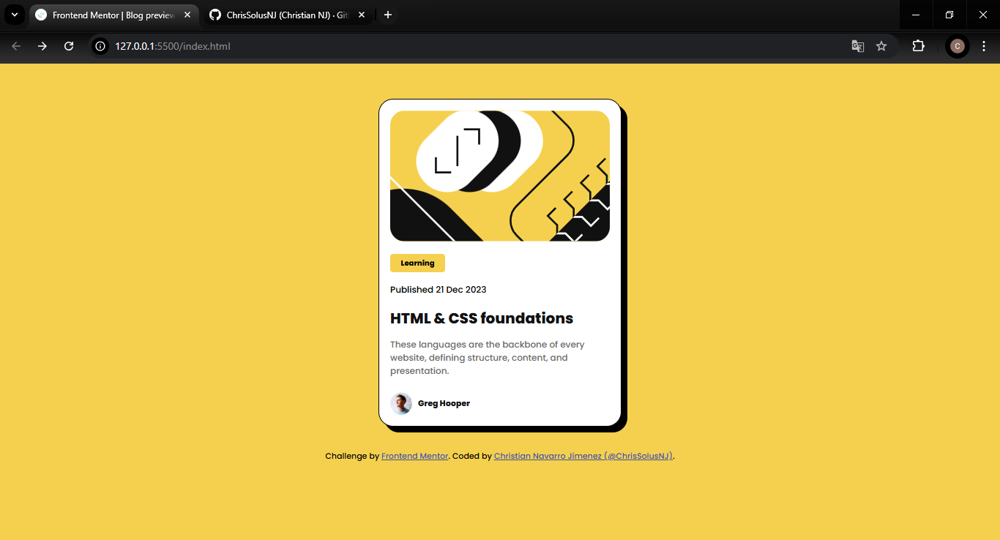
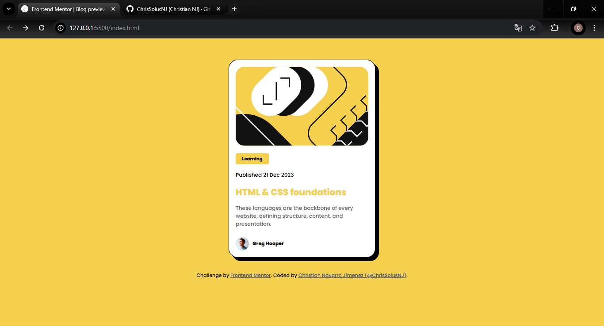

# Frontend Mentor - Blog preview card solution

This is a solution to the [Blog preview card challenge on Frontend Mentor](https://www.frontendmentor.io/challenges/blog-preview-card-ckPaj01IcS). Frontend Mentor challenges help you improve your coding skills by building realistic projects. 

## Table of contents

- [Overview](#overview)
  - [The challenge](#the-challenge)
  - [Screenshot](#screenshot)
  - [Links](#links)
- [My process](#my-process)
  - [Built with](#built-with)
  - [What I learned](#what-i-learned)
  - [Continued development](#continued-development)
  - [Useful resources](#useful-resources)
- [Author](#author)
- [Acknowledgments](#acknowledgments)

## Overview

  In this challenge, basic HTML and CSS elements were applied to create a blog card preview with some elements that are already provided to us in practice, such as images, colors and fonts. In addition, the use of elements in CSS classes for when some element of the page is being used, either because it was clicked or the cursor is over it.

### The challenge

Users should be able to:

- See hover and focus states for all interactive elements on the page

### Screenshot

### Links

- Solution URL: [Add solution URL here](https://your-solution-url.com)
- Live Site URL: [GitHub Pages](https://chrissolusnj.github.io/Blog-Preview-Card/)

## My process

### Built with

- Semantic HTML5 markup
- CSS custom properties
- Flexbox
- CSS Grid
- Mobile-first workflow
- [HTML](https://developer.mozilla.org/es/docs/Web/HTML) - HTML library
- [CSS](https://developer.mozilla.org/en-US/docs/Web/CSS/box-shadow) - Box-shadow CSS

### What I learned

This practice helped me to reinforce some HTML and CSS elements, as well as learn to improve my search for information in official documentation. The most complicated thing for me has been the CSS styles, since there are so many rules and you have to manage so many things (CSS grid and Flexbox to mention two), it becomes quite complex to select the best properties that fit a project.

### Continued development

For future projects I would like to improve more on the CSS rules applied to a web page, improve the responsive design, flexbox and use better units of measurement for the different elements of the page, as well as the colors and customization of the page.

### Useful resources

- [HTML](https://developer.mozilla.org/es/docs/Web/HTML) - HTML library: It helped me find some HTML elements and how to use them.
-[CSS](https://developer.mozilla.org/en-US/docs/Web/CSS/box-shadow) - Box-shadow CSS: On this documentation page you can learn more about how box shadows work on elements on a web page so you can apply them to solve this challenge.

## Author

- Website - [@ChrisSolusNJ](https://github.com/ChrisSolusNJ)
- Frontend Mentor - [@ChrisSolusNJ](https://www.frontendmentor.io/profile/ChrisSolusNJ)
